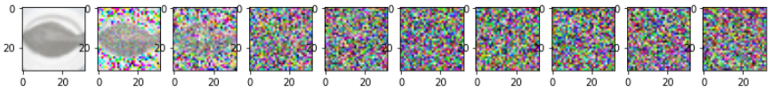
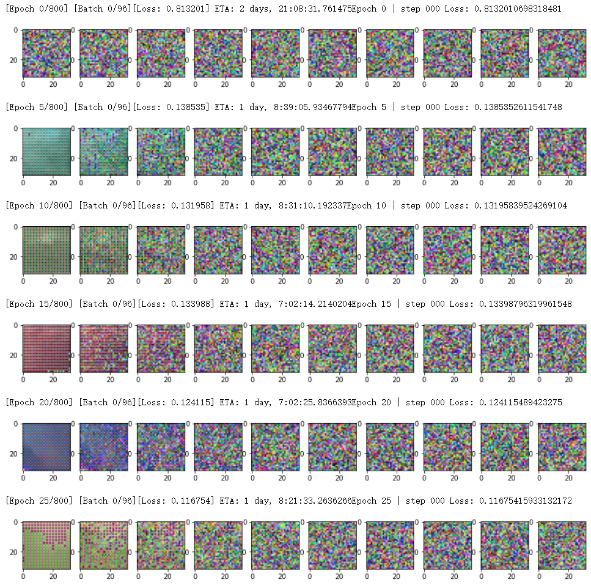

# simple_diffusion
 a simple pytorch implementation of diffusiom model


## Denoising Diffusion Probabilistic Models

A simple implementation of Denoising Diffusion Probabilistic Models for image generation written in PyTorch. This roughly follows the original code by Ho et al. Unlike their implementation.

### Step 1: Forward process/noise scheduler
We first need to construct the inputs for our model, which are increasingly noisy images. Instead of performing this operation sequentially, we can use the closed form provided in the paper to compute the images individually for any time step.

#### Key Points

- Noise level/variance can be pre-calculated
- Different types of variance tables are available
- We can sample the images for each time step independently (sum of Gaussians is also Gaussian)
- No model is needed in this advance step


```
import torch.nn.functional as F

def linear_beta_schedule(timesteps, start=0.0001, end=0.02):
    return torch.linspace(start, end, timesteps)

def get_index_from_list(vals, t, x_shape):
    """ 
    返回所传递的值列表vals中的特定索引，同时考虑到批处理维度。
    """
    batch_size = t.shape[0]
    out = vals.gather(-1, t.cpu())
    return out.reshape(batch_size, *((1,) * (len(x_shape) - 1))).to(t.device)

def forward_diffusion_sample(x_0, t, device=device):
    """ 
    接收一个图像和一个时间步长作为输入，并返回它的噪声版本
    """
    noise = torch.randn_like(x_0)
    sqrt_alphas_cumprod_t = get_index_from_list(sqrt_alphas_cumprod, t, x_0.shape)
    sqrt_one_minus_alphas_cumprod_t = get_index_from_list(
        sqrt_one_minus_alphas_cumprod, t, x_0.shape
    )
    #均值+方差
    return sqrt_alphas_cumprod_t.to(device) * x_0.to(device) \
    + sqrt_one_minus_alphas_cumprod_t.to(device) * noise.to(device), noise.to(device)


# 界定测试时间表
T = 300
betas = linear_beta_schedule(timesteps=T)

# 预先计算闭合形式的不同项
alphas = 1. - betas
alphas_cumprod = torch.cumprod(alphas, axis=0)
alphas_cumprod_prev = F.pad(alphas_cumprod[:-1], (1, 0), value=1.0)
sqrt_recip_alphas = torch.sqrt(1.0 / alphas)
sqrt_alphas_cumprod = torch.sqrt(alphas_cumprod)
sqrt_one_minus_alphas_cumprod = torch.sqrt(1. - alphas_cumprod)
posterior_variance = betas * (1. - alphas_cumprod_prev) / (1. - alphas_cumprod)
```
Now let's read our training data
```
training_x = []
path = './data/train/'  # 要改
path_list = os.listdir(path)
path_list.sort(key=lambda x: int(x.split('.')[0]))
for item in path_list:
    impath = path + item
    # print("开始处理"+impath)
    imgx = cv2.imread(path + item)
    imgx = cv2.cvtColor(imgx, cv2.COLOR_BGR2RGB)
    # imgx=imgx/255.0
    training_x.append(imgx)

X_train = []

for features in training_x:
    X_train.append(features)

# X_train = np.array(X_train).reshape(-1,3,256,256)
X_train = np.array(X_train)
X_train=X_train.astype(dtype)
X_train= torch.from_numpy(X_train)
X_train=X_train.permute(0,3,1,2)
X_train=X_train/255.0
print(X_train.shape)
```
```
batch_size = 512
train_loader = DataLoader(X_train,batch_size=batch_size,shuffle=True,drop_last=True,num_workers=2)
```
Simulate the forward diffusion process and output an visual example.
```
image = next(iter(train_loader))[0]

plt.figure(figsize=(15,15))
plt.axis('off')
num_images = 10
stepsize = int(T/num_images)

for idx in range(0, T, stepsize):
    t = torch.Tensor([idx]).type(torch.int64)
    plt.subplot(1, num_images+1, int(idx/stepsize) + 1)
    image, noise = forward_diffusion_sample(image, t)
    show_tensor_image(image)
```


### Step 2: Back Propagation/U-Net
U-Net tutorial: https://amaarora.github.io/2020/09/13/unet.html.

#### Key points:

- We use a simple form of UNet to predict the noise in an image
- The input is a noisy image and the output is the noise in the image
- Since the parameters are shared across time, we need to tell the network at which time step we are
- Timestep is encoded by the transformer Sinusoidal Embedding
- We output a single value (the mean) because the variance is fixed

```
from torch import nn
import math


class Block(nn.Module):
    def __init__(self, in_ch, out_ch, time_emb_dim, up=False):
        super().__init__()
        self.time_mlp =  nn.Linear(time_emb_dim, out_ch)
        if up:
            self.conv1 = nn.Conv2d(2*in_ch, out_ch, 3, padding=1)
            self.transform = nn.ConvTranspose2d(out_ch, out_ch, 4, 2, 1)
        else:
            self.conv1 = nn.Conv2d(in_ch, out_ch, 3, padding=1)
            self.transform = nn.Conv2d(out_ch, out_ch, 4, 2, 1)
        self.conv2 = nn.Conv2d(out_ch, out_ch, 3, padding=1)
        self.bnorm1 = nn.BatchNorm2d(out_ch)
        self.bnorm2 = nn.BatchNorm2d(out_ch)
        self.relu  = nn.ReLU()
        
    def forward(self, x, t, ):
        # 第一次卷积
        h = self.bnorm1(self.relu(self.conv1(x)))
        # 时间嵌入
        time_emb = self.relu(self.time_mlp(t))
        # 扩展到最后2个维度
        time_emb = time_emb[(..., ) + (None, ) * 2]
        # 添加时间通道
        h = h + time_emb
        # 第二次卷积
        h = self.bnorm2(self.relu(self.conv2(h)))
        # 上采样或者下采样
        return self.transform(h)


class SinusoidalPositionEmbeddings(nn.Module):
    def __init__(self, dim):
        super().__init__()
        self.dim = dim

    def forward(self, time):
        device = time.device
        half_dim = self.dim // 2
        embeddings = math.log(10000) / (half_dim - 1)
        embeddings = torch.exp(torch.arange(half_dim, device=device) * -embeddings)
        embeddings = time[:, None] * embeddings[None, :]
        embeddings = torch.cat((embeddings.sin(), embeddings.cos()), dim=-1)
        return embeddings


class SimpleUnet(nn.Module):
    """
    Unet架构的一个简化版本
    """
    def __init__(self):
        super().__init__()
        image_channels = 3
        down_channels = (64, 128, 256, 512, 1024)
        up_channels = (1024, 512, 256, 128, 64)
        out_dim = 1 
        time_emb_dim = 32

        # 时间嵌入
        self.time_mlp = nn.Sequential(
                SinusoidalPositionEmbeddings(time_emb_dim),
                nn.Linear(time_emb_dim, time_emb_dim),
                nn.ReLU()
            )
        
        # 初始预估
        self.conv0 = nn.Conv2d(image_channels, down_channels[0], 3, padding=1)

        # 下采样
        self.downs = nn.ModuleList([Block(down_channels[i], down_channels[i+1], \
                                    time_emb_dim) \
                    for i in range(len(down_channels)-1)])
        # 上采样
        self.ups = nn.ModuleList([Block(up_channels[i], up_channels[i+1], \
                                        time_emb_dim, up=True) \
                    for i in range(len(up_channels)-1)])

        self.output = nn.Conv2d(up_channels[-1], 3, out_dim)

    def forward(self, x, timestep):
        # 时间嵌入
        t = self.time_mlp(timestep)
        # 初始卷积
        x = self.conv0(x)
        # Unet
        residual_inputs = []
        for down in self.downs:
            x = down(x, t)
            residual_inputs.append(x)
        for up in self.ups:
            residual_x = residual_inputs.pop()
            # 添加残差结构作为额外的通道
            x = torch.cat((x, residual_x), dim=1)           
            x = up(x, t)
        return self.output(x)

model = SimpleUnet()
print("Num params: ", sum(p.numel() for p in model.parameters()))
model
```
### Step 3: Loss Function
```
def get_loss(model, x_0, t):
    x_noisy, noise = forward_diffusion_sample(x_0, t, device)
    noise_pred = model(x_noisy, t)
    return F.l1_loss(noise, noise_pred)
```
#### Sampling
If we don't use @torch.no_grad(), we will soon run out of memory because pytorch will pack all the previous images for the gradient calculation.

Since we pre-calculate the noise variance of the forward channel, we must also use these variances when we execute the backward process in sequence.

```
@torch.no_grad()#防止内存爆炸
def sample_timestep(x, t):
    """
    调用模型来预测图像中的噪声，并返回 
    去噪后的图像。
    如果我们还没有进入最后一步，则对该图像施加噪声。
    """
    betas_t = get_index_from_list(betas, t, x.shape)
    sqrt_one_minus_alphas_cumprod_t = get_index_from_list(
        sqrt_one_minus_alphas_cumprod, t, x.shape
    )
    sqrt_recip_alphas_t = get_index_from_list(sqrt_recip_alphas, t, x.shape)
    
    # 调用模型（当前图像--噪声预测）。
    model_mean = sqrt_recip_alphas_t * (
        x - betas_t * model(x, t) / sqrt_one_minus_alphas_cumprod_t
    )
    posterior_variance_t = get_index_from_list(posterior_variance, t, x.shape)
    
    if t == 0:
        return model_mean
    else:
        noise = torch.randn_like(x)
        return model_mean + torch.sqrt(posterior_variance_t) * noise 

@torch.no_grad()
def sample_plot_image():
    # 样本噪声
    img_size = IMG_SIZE
    img = torch.randn((1, 3, img_size, img_size), device=device)
    plt.figure(figsize=(15,15))
    plt.axis('off')
    num_images = 10
    stepsize = int(T/num_images)

    for i in range(0,T)[::-1]:
        t = torch.full((1,), i, device=device, dtype=torch.long)
        img = sample_timestep(img, t)
        if i % stepsize == 0:
            plt.subplot(1, num_images, int(i/stepsize+1))
            show_tensor_image(img.detach().cpu())
    plt.show()            
```
#### Training
```
model = SimpleUnet()
model.to(device)
optimizer = Adam(model.parameters(), lr=0.001)
epochs = 800
T = 300
betas = linear_beta_schedule(timesteps=T)
IMG_SIZE=32


loss_min=1000

for epoch in range(epochs):
    model.train()
    for step, batch in enumerate(train_loader):
        x=Variable(batch).cuda()
        t = torch.randint(0, T, (batch_size,), device=device).long()
        loss = get_loss(model, x, t)
        
             
        optimizer.zero_grad()
        loss.backward()
        optimizer.step()
        batches_done = epoch * len(train_loader) +step
        batches_left = epochs * len(train_loader) - batches_done
        time_left = datetime.timedelta(seconds=batches_left * (time.time() - prev_time))
        prev_time = time.time()
        # Print log
        sys.stdout.write(
            "\r[Epoch %d/%d] [Batch %d/%d][Loss: %f] ETA: %s"
            % (
                epoch,
                epochs,
                step,
                len(train_loader),
                loss.item(),
                time_left,
            )
        )
        if loss_min>loss.item():
            torch.save(model.state_dict(), "./checkpoint/" +str(epoch)+ 'unet-best.pth')
        
        if epoch % 5 == 0 and step == 0:
            print(f"Epoch {epoch} | step {step:03d} Loss: {loss.item()} ")
            sample_plot_image(model,IMG_SIZE=32)
```




If you need to train this simple diffusion model from scratch, you need to download the dataset from [Baidu](https://pan.baidu.com/s/1OFIbBkd_YOehUwZUr-SU7Q) (The password is data) or [Google](https://drive.google.com/file/d/1MmH_flOgcFlJWXvAHHOvSRp1RsyILwVt/view?usp=sharing)

Then, run the `train.ipynb` file with jupyter notebook, and the trained model weight file will be automatically saved in `checkpoint` folder. 

Environmental requirements:

- Python 3.7 or a newer version

- Pytorch 1.7 0r a newer version

- CUDA 10.1 or a newer version

- OpenCV 4.5.3 or a newer version

- Jupyter Notebook


## Citations

```bibtex
@misc{ho2020denoising,
    title   = {Denoising Diffusion Probabilistic Models},
    author  = {Jonathan Ho and Ajay Jain and Pieter Abbeel},
    year    = {2020},
    eprint  = {2006.11239},
    archivePrefix = {arXiv},
    primaryClass = {cs.LG}
}
```

